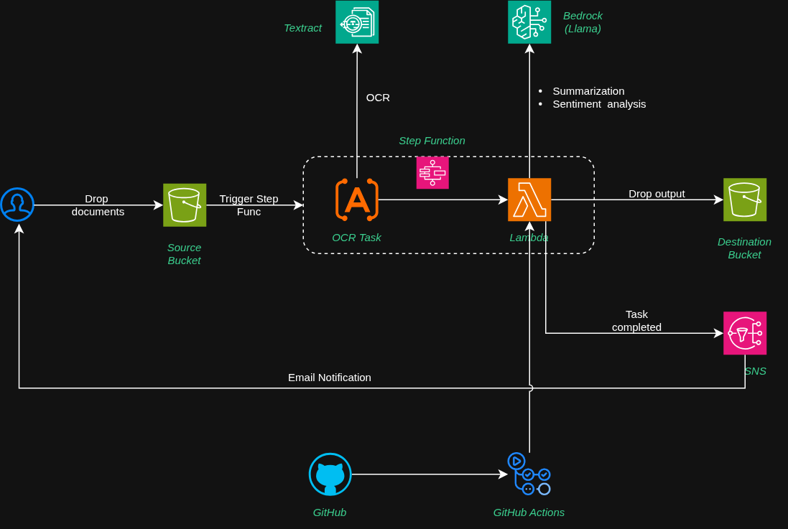

# Multi-Cloud Asynchronous Document Processing Reference Architecture

This repository contains a reference implementation for an automated, asynchronous document processing pipeline across the three major cloud providers: **AWS**, **Azure**, and **GCP**.

The goal of this project is to demonstrate how to orchestrate OCR and Generative AI (LLM) services to transform raw images/documents into structured, summarized data with sentiment analysis.

## Architecture Overview

The solution follows a consistent logical flow across all platforms:
1.  **Ingestion:** Triggered by object storage uploads or scheduled polling.
2.  **Orchestration:** A serverless workflow manages the execution sequence.
3.  **Extraction (OCR):** High-accuracy text extraction from images.
4.  **Intelligence (LLM):** Summarization and sentiment analysis.
5.  **Persistence:** Results are stored back to object storage.
6.  **Notification:** Users are notified of completion via email/messaging.

---

### Cloud Provider Implementations

#### 1. Amazon Web Services (AWS)
Using a Lambda-heavy approach for service integration.
* **Storage:** Amazon S3
* **Orchestration:** AWS Step Functions
* **OCR:** Amazon Textract
* **Compute:** AWS Lambda (used for Bedrock invocation)
* **LLM:** Amazon Bedrock
* **Notification:** Amazon SNS



#### 2. Microsoft Azure
Utilizing Azure's native serverless ecosystem.
* **Storage:** Azure Blob Storage
* **Orchestration:** Azure Logic Apps / Durable Functions
* **OCR:** Azure AI Document Intelligence
* **Compute:** Azure Functions (used for OpenAI invocation)
* **LLM:** Azure OpenAI Service
* **Notification:** Azure Communication Services


#### 3. Google Cloud Platform (GCP)
Demonstrating direct service integration (Direct HTTP/Connector) from the workflow to the LLM.
* **Storage:** Cloud Storage (Buckets)
* **Orchestration:** Google Cloud Workflows
* **OCR:** Document AI
* **LLM:** Vertex AI (Gemini via direct Workflow invocation)
* **Notification:** Cloud Pub/Sub


---

## Infrastructure and CI/CD

* **Infrastructure as Code (IaC):** Powered by **OpenTofu**. This ensures consistent resource provisioning across providers.
* **CI/CD:** **GitHub Actions** are used to deploy the function code.

---

## Roadmap to Production

This is a **Reference Architecture** and is not intended for immediate production use. The following areas must be addressed for a production-grade deployment:

### 1. State Management
Currently, OpenTofu state is managed locally. For production, transition to a remote backend with state locking:
* Example: `backend "s3" { bucket = "my-tofu-state" }`

### 2. Deployment Strategies
The current CI/CD implements "all-at-once" deployment. Production environments should implement:
* **Canary Releases:** Gradually shifting traffic to new versions.
* **Blue/Green:** Full environment swaps to ensure zero downtime and easy rollbacks.

### 3. Observability
Comprehensive monitoring is currently omitted. Required additions include:
* **Metrics & Alarms:** Monitoring for workflow failures and LLM latency.
* **Structured Logging:** Centralized logs via CloudWatch, Azure Monitor, or Google Cloud Operations Suite.

### 4. Security & IAM
Permissions are currently broad for ease of demonstration.
* **Least Privilege:** IAM roles and policies must be hardened to restrict access only to specific buckets and API actions.
* **Secrets Management:** Use Vault or native Secret Managers for API keys and credentials.

---

## Getting Started

1. Navigate to the provider directory (e.g., `/aws`).
2. Initialize the infrastructure:
   ```bash
   tofu init
   tofu plan
   tofu apply
